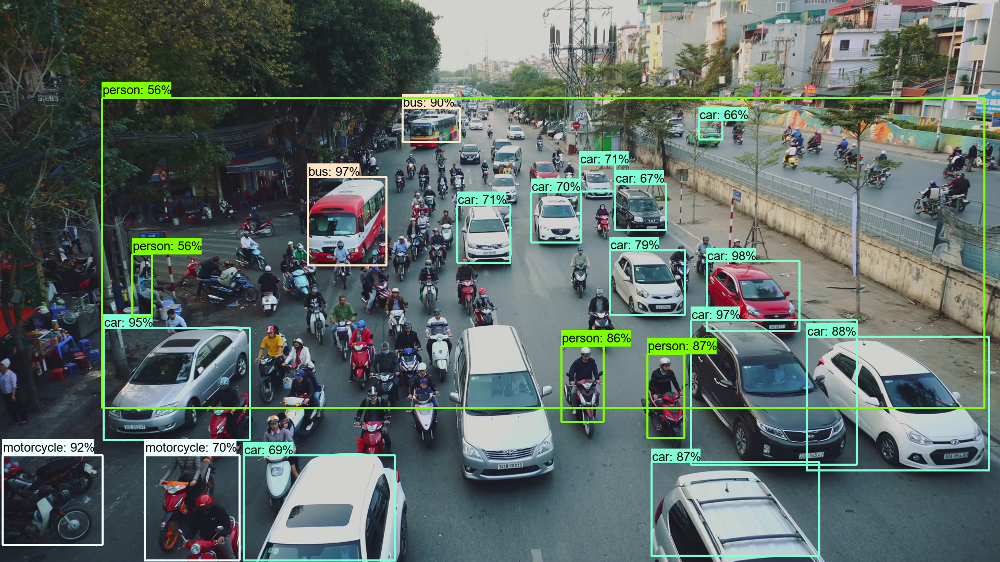

<html>
<body>
<h1>TensorflowObjectDetector2</h1>
<b>
This is a simple python class TensorflowObjectDetector based on Tensorflow2 Object Detection API. 
</b>
 

We have downloaded <a href="https://github.com/tensorflow/models/tree/master/research/object_detection">Tensorflow2 Object Detection API</a>.
and installed tensorflow==2.2.0. 

<table style="border: 1px solid red;">
<tr><td>

git clone https://github.com/tensorflow/models.git 
pip install tensorflow==2.2.0 
pip install Cython 
pip install tf_slim 
pip install protobuf 
protoc object_detection\protos\*.proto --python_out=.' 

</td></tr>

</table>

 
Run TensorflowObjectDetector2.py script to detect objects in an image in the following way.  
<b>
>python TensorflowObjectDetector2.py .\images\img.png 
</b>
 

 
In this case, we use CocoModelDownloader class and download the followng file:
  'faster_rcnn_inception_v2_coco_2018_01_28.tar.gz' 
from 'http://download.tensorflow.org/models/object_detection/'.
 
 
 
See also: https://github.com/atlan-antillia/TensorflowObjectDetector

