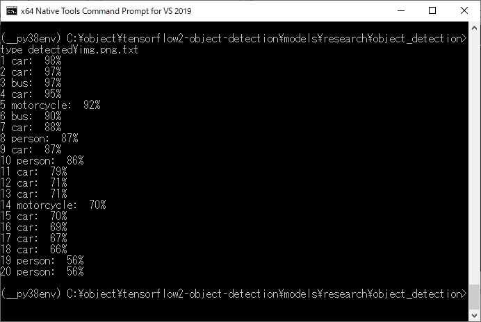
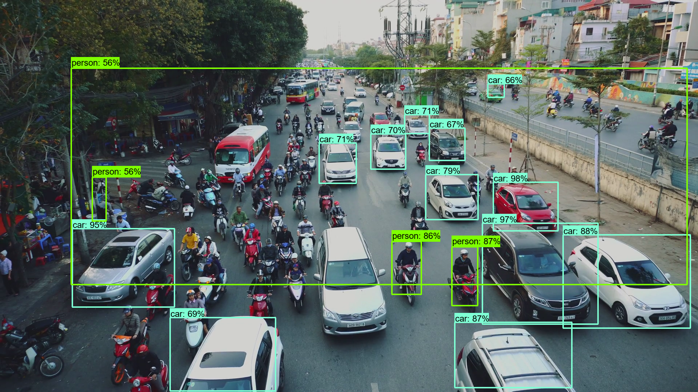

<html>
<body>
<h1>TensorflowObjectDetector2</h1>
<b>
This is a simple python class TensorflowObjectDetector2 based on Tensorflow2 Object Detection API. 
</b>
 
<h2> 1 Installation </h2>

 We have downloaded <a href="https://github.com/tensorflow/models/tree/master/research/object_detection">Tensorflow2 Object Detection API</a>.
and installed tensorflow==2.2.0. 
 
<table style="border: 1px solid red;">
<tr><td>

git clone https://github.com/tensorflow/models.git 
pip install tensorflow==2.2.0 
pip install Cython 
pip install tf_slim 
pip install protobuf 
protoc object_detection\protos\*.proto --python_out=.' 

</td></tr>
</table>

 
Please clone <a href="https://github.com/atlan-antillia/TensorflowObjectDetector2.git">TensorflowObjectDetector2.git</a> in a working folder.
<pre>
>git clone  https://github.com/atlan-antillia/TensorflowObjectDetector2.git
</pre>
Copy the files in that folder to <i>somewhere_cloned_folder/models/research/object_detection/</i> folder.
 

<h2>2 TensorflowObjectDetector2 class</h2>
 We have updated TensorflowObjectDetector2 class and added a new <i>vis_utils2.py</i> file to be able to save detected objects information of the list of 
each detected object data (id, label, score) to a text file.

 
Run TensorflowObjectDetector2.py script to detect objects in an image in the following way.  
<b>
<pre>
>python TensorflowObjectDetector2.py .\images\img.png detected 
</pre>
</b>
 

 
In this case, we use CocoModelDownloader class and download the followng file:
  'faster_rcnn_inception_v2_coco_2018_01_28.tar.gz' 
from 'http://download.tensorflow.org/models/object_detection/'.
 
 

 
See also: https://github.com/atlan-antillia/TensorflowObjectDetector

<h2>3 Filters </h2>
 We have also updated TensorflowObjectDetector2 class to accept filters to select some classes
 only specified by filters. 
We use the following list format to define filters: 
<pre>
 [person,car]
</pre>

For example, you can run the following command to select persons or cars only from an imput image file. 
<pre> 
python TensorflowObjectDetector2.py .\images\img.png detected [person,car]
</pre>

 

 

 

 

 